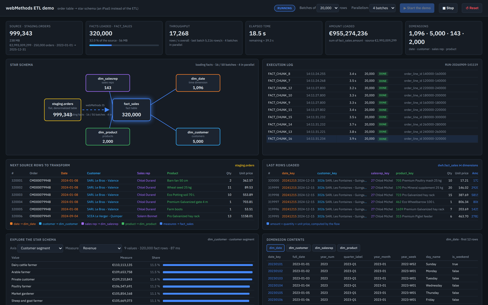
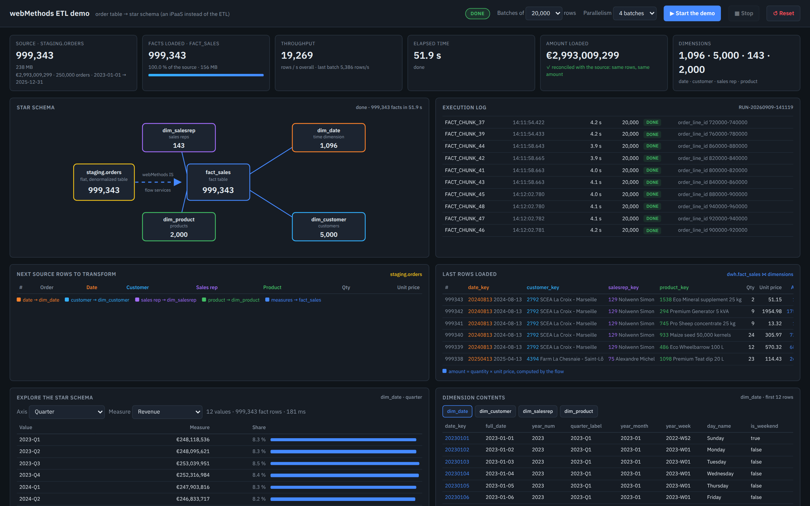
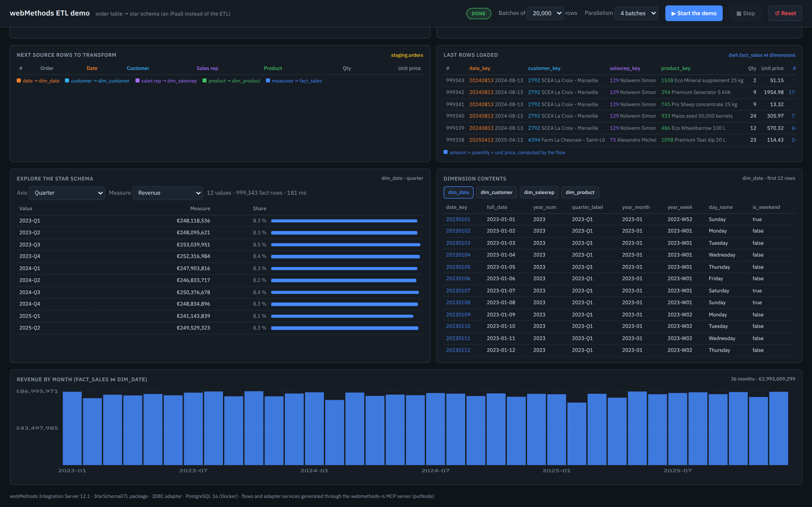
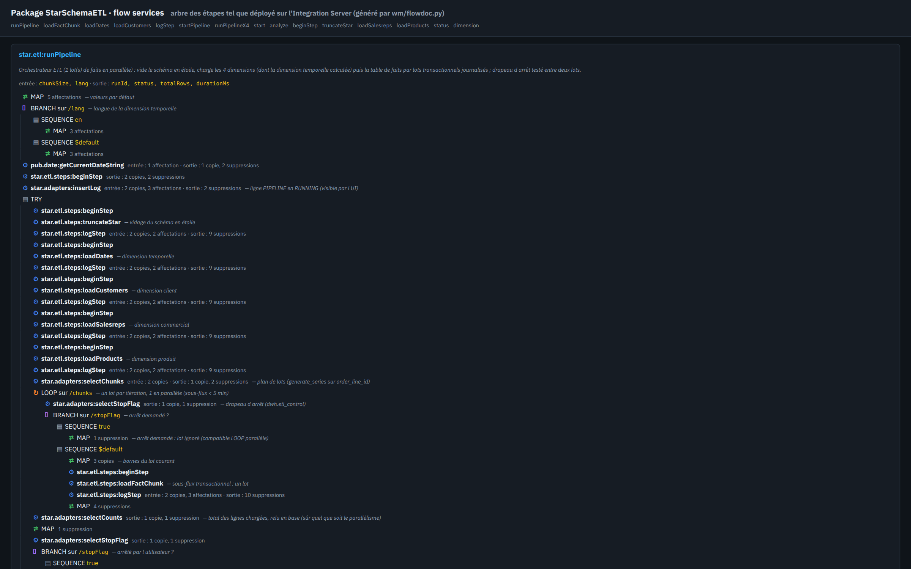

# ETL demo: webMethods Integration Server instead of a classic ETL (star schema)

Reference scenario: ERP data lands in *staging* tables (replication of a data lake), is normalized, then
transformed into fact tables, with sub-flows of less than 5 minutes each.
The demo reproduces this pattern on a concrete case: a **flat, classic order table** (customer, sales rep,
product, quantity, unit price, about 1 million rows) transformed by webMethods Integration Server into a
**star schema** (central fact table + 4 dimensions, including a time dimension), with a control and
near-real-time visualization UI.

```
 staging.orders (999,343 rows, 245 MB)                       dwh (star schema)
 ┌─────────────────────────────────────┐                     ┌──────────────┐
 │ order_id, order_date                │   webMethods IS     │  dim_date    │ 1,096 (computed in the flow)
 │ customer_code, name, city, dept, …  │ ─── package ──────▶ │  dim_customer│ 5,000
 │ salesrep_code, name, region         │   StarSchemaETL     │  dim_salesrep│   143
 │ product_code, name, category, brand │  (flows + JDBC)     │  dim_product │ 2,000
 │ quantity, unit_price                │                     │  fact_sales  │ 999,343 (amount = qty × unit price)
 └─────────────────────────────────────┘                     └──────────────┘
```

## Screenshots

Pipeline running (4 batches in parallel, sub-flow log, source rows and loaded rows):



Pipeline done and reconciled (999,343 facts in 51.5 s), explorer by quarter, contents of the time dimension:



Revenue by month computed on the star schema, and the flows page generated from the Integration Server:





## Components

| Item | Where | Details |
|---|---|---|
| PostgreSQL 16 | Docker container `stardemo-db`, port **5435** (`stardemo`/`stardemo`, overridable with `DB_NAME`, `PG_PORT`, `DB_CONTAINER`) | `db/01_schema.sql` (schemas `staging`, `dwh`, log `etl_run_log`, control `etl_control`), `db/02_generate_data.sql` (reproducible data set) |
| Integration Server 12.1 | `$IS_HOME` (default `/home/cpo/wm12/IntegrationServer/instances/default`), port **5555** (`Administrator`/`manage`) | package **StarSchemaETL** (namespace `star.*`) |
| JDBC connections | `star.connections:dwh` (LOCAL_TRANSACTION), `star.connections:dwhLog` (NO_TRANSACTION) | JDBC adapter 10.3, DataDirect PostgreSQL driver |
| Adapter services | `star.adapters:*` | 24 CustomSQL / BatchInsert services (`wm/adapters.py`) |
| Flows | `star.etl.steps:*`, `star.etl:*` | generated as putNode JSON (`wm/flows.py`) |
| UI API | `star.api:status / start / stop / reset` | JSON through `/invoke/star.api/<service>` |
| UI | `ui/index.html` → `packages/StarSchemaETL/pub/index.html` | **http://localhost:5555/StarSchemaETL/index.html** |

### Flows

- `star.etl:runPipeline` (orchestrator, variants `runPipelineX2` / `runPipelineX4` with `MAX-THREADS` on the
  LOOP): TRUNCATE_STAR → DIM_DATE → DIM_CUSTOMER → DIM_SALESREP → DIM_PRODUCT → batch plan
  (`selectChunks`, `generate_series` on `order_line_id`) → LOOP: one `loadFactChunk` sub-flow per batch,
  logged, with the stop flag checked at every batch; total read back from the database after the loop.
- `star.etl.steps:loadDates` (time dimension): for each distinct date of the source (1,096 days), the flow
  computes with `pub.date:dateTimeFormat` (locale `en_GB`, ISO rule), `pub.math` and a BRANCH:

  | Column | Example | Computation in the flow |
  |---|---|---|
  | `date_key` | 20250908 | pattern `yyyyMMdd` (fact table key) |
  | `year_num`, `quarter_num`, `quarter_label` | 2025, 3, `2025-Q3` | `yyyy`; quarter = (month + 2) / 3 (`pub.math:addInts`, `divideInts`); label by substitution `%dates/year_num%-Q%dates/quarter_num%` |
  | `month_num`, `month_name`, `year_month` | 9, September, `2025-09` | `M`, `MMMM`, `yyyy-MM` |
  | `week_of_year`, `year_week` | 37, `2025-W37` | `w` and `YYYY-'W'ww` in locale `en_GB`: ISO weeks (Monday, 4 days minimum), so 2023-01-01 → `2022-W52`, 2024-12-30 → `2025-W01` |
  | `day_of_month`, `day_of_week`, `day_name` | 8, 1, Monday | `d`, `u` (1 = Monday … 7 = Sunday), `EEEE` |
  | `is_weekend` | false | BRANCH on `day_of_week` (6, 7 → true) |

  The Year / Quarter / Month / Week (ISO) / Weekday axes of the explorer rely on these columns.
- `star.etl.steps:loadFactChunk`: `startTransaction` → extraction of the batch with surrogate-key
  resolution by join → row-by-row LOOP (projection + `amount = quantity × unit_price` with
  `pub.math:multiplyFloats`) → `BatchInsert` (a single `executeBatch`) → `commitTransaction`; `rollback` in CATCH.
- `star.etl:startPipeline`: asynchronous start through the IS scheduler (`pub.scheduler:addOneTimeTask`, +3 s).
- `star.etl.steps:logStep`: logs every step (duration computed by the flow) in `dwh.etl_run_log`,
  on the non-transactional connection, so it is visible immediately to the UI.

### Additional views

- **http://localhost:5555/StarSchemaETL/flows.html**: step tree of every flow service (generated by `wm/flowdoc.py`),
  handy to explain the logic without opening Designer.
- **Explore the star schema** panel in the UI: queries by dimension (year, quarter, month, day, segment,
  department, customer, region, sales rep, category, brand, product × revenue, quantities, lines, average line
  amount) and dimension table contents, refreshed while loading.
- **Parallelism**: 1 / 2 / 4 simultaneous batches selector (orchestrators `runPipeline`, `runPipelineX2`,
  `runPipelineX4`, native parallel LOOP `MAX-THREADS`).

## Running the demo

```bash
# 1. database (if the container is stopped)
docker start stardemo-db
# 2. Integration Server (about 40 s)
/home/cpo/wm12/IntegrationServer/instances/default/bin/startup.sh
# 3. UI
xdg-open http://localhost:5555/StarSchemaETL/index.html      # login Administrator / manage
```

In the UI:

- **▶ Start the demo**: schedules the pipeline (batch size 10,000 / 20,000 / 50,000 rows, 1 / 2 / 4 batches in
  parallel); refused if a pipeline is already running.
  Counters, star schema, log, throughput, "next source rows" and "last rows loaded" refresh every 1.5 s;
  the revenue by month builds up live.
- **■ Stop**: the pipeline stops cleanly (status STOPPED): remaining batches are skipped, batches in progress
  finish and are committed (also works with 2 or 4 batches in parallel).
- **↺ Reset**: empties the star schema and the log (`dwh.reset_demo()`) to start over; if a pipeline is
  running, it is stopped first.

Useful checks on the database side (`docker exec -it stardemo-db psql -U stardemo`):

```sql
SELECT * FROM dwh.v_etl_last_run;      -- log of the last run
SELECT * FROM dwh.v_reconciliation;    -- rows and amounts, source vs facts
```

## Installing the package without wm-mcp-server

`packages/StarSchemaETL` is the Integration Server package exactly as deployed (manifest, namespace tree with the
document types, JDBC adapter services and flow services, UI in `pub/`). To install it on an IS 12.1 with the JDBC
adapter and the PostgreSQL driver:

1. Copy the `packages/StarSchemaETL` folder into `IntegrationServer/instances/default/packages/` (or zip its content
   and use Packages > Management > Install Inbound Releases), then activate or reload the package.
2. Create the two JDBC adapter connections the package expects (they are environment specific and are not shipped):
   `star.connections:dwh` (transaction type LOCAL_TRANSACTION, other properties `BatchPerformanceWorkaround=true`)
   and `star.connections:dwhLog` (NO_TRANSACTION), both on `localhost:5435`, database, user and password `stardemo`,
   data source class `com.wm.dd.jdbcx.postgresql.PostgreSQLDataSource`. `python3 wm/package.py` creates them through
   wm-mcp-server if you have it.
3. Enable the connections and reload the package: the adapter services bind to them, the UI is served at
   `http://localhost:5555/StarSchemaETL/index.html`.

`./deploy.sh export` refreshes `packages/StarSchemaETL` from the running IS after a rebuild.

## Redeploy / rebuild

```bash
./deploy.sh        # everything: container + schema, data (about 10 s), IS package, UI
./deploy.sh data   # regenerate the data set
./deploy.sh is     # package: connections, adapter services, flows, UI
python3 wm/test_steps.py   # unit tests of the steps (truncate, then load one 5,000-row batch)
```

The scripts drive the IS through the `webmethods-is` MCP server (wm-mcp-server, binary given by `WM_MCP_BIN`),
either from Claude Code (`.mcp.json`, template in `.mcp.json.example`) or from the command line with `wm/mcpcli.py`
(stdio JSON-RPC). Prerequisites: Docker, Python 3 (Playwright and ffmpeg for the video), an Integration Server 12.1
with the JDBC adapter and the PostgreSQL driver.

## Reference figures (measured on 2026-09-08, WSL2, 16 vCPU, IS Xmx 1 GB)

| Step | Rows | Duration |
|---|---|---|
| Time dimension (computed in the flow) | 1,096 | 0.4 s |
| Customer / sales rep / product dimensions | 5,000 / 143 / 2,000 | 0.4 s / 0.2 s / 0.3 s |
| Fact table, 50 batches of 20,000 rows, 1 batch at a time | 999,343 | 1 min 57 s (about 2.3 s per batch, about 8,700 rows/s) |
| Fact table, 50 batches of 20,000 rows, 4 batches in parallel | 999,343 | 48 s (about 3.2 s per batch, about 21,000 rows/s) |
| Reconciliation `dwh.v_reconciliation` | 999,343 = 999,343 | amount 2,993,009,298.57 € identical |

Each batch is an independent sub-flow (committed transaction), far below the 5-minute target per sub-flow.

## French version

- UI: `http://localhost:5555/StarSchemaETL/index.html?lang=fr` (texts, number formats, statuses).
- Time dimension: `star.api:start` passes `lang`; in French the `loadDates` flow uses the `fr_FR` locale
  (`lundi`, `septembre`) and the labels `2025-T3` / `2025-S37` (English: `en_GB`, ISO weeks, `2025-Q3` / `2025-W37`).
- Data set: `./deploy.sh data-fr` (categories, products and segments in French, same volumes);
  `./deploy.sh data` to return to the English data set.
- Video: `python3 video/record_demo.py --lang fr` (French cards `*-fr.html`), then `make_video.py`, `chapters.py`,
  `make_thumbnail.py` (files `ipaas-etl-star-schema-demo-fr*.mp4`, `thumbnail-fr.png`).

## Name neutrality

The IS package is called `StarSchemaETL` (namespace `star.*`), the database `stardemo`; screens, title cards,
thumbnail, post and this repository do not name any company (no customer, no ETL vendor, no ERP).

## Video and communication

- `video/record_demo.py` records the demo with Playwright (title cards in `video/cards/`, captions, two runs:
  sequential then 4 batches in parallel); `video/make_video.py` produces `video/ipaas-etl-star-schema-demo.mp4`
  (videos are not versioned) in real time (5 min 54 s) and a condensed version (waits sped up, 4 min 23 s);
  `video/chapters.py`, `video/make_thumbnail.py` and `video/frames.py` produce chapters, thumbnail and control frames.
  Take of 2026-09-08: 2 min 33 s (1 batch) and 1 min 10 s (4 batches). Video encoding on the same machine slows
  the loads by about 30 % compared with the measurements without capture (1 min 57 s / 49 s). Record on an idle
  machine (no compilation or other load in parallel).
- `docs/linkedin-post.md`: LinkedIn post text, YouTube sheet, thumbnail `video/thumbnail.png`.

## Order of magnitude

The source table (999,343 rows, 245 MB) is twice the average staging table of a mid-sized ERP. With the
throughput measured without screen capture (8,700 rows/s, about 1.9 MB/s sequential; 20,000 rows/s, about 4.6 MB/s
with 4 batches), a 1 GB table loads in 9 min / 3.7 min, before any parallelism between tables (scheduler) and
as a full reload, whereas an ETL of this kind works in delta mode. For a demo at that scale: 1,000,000 orders
in `db/02_generate_data.sql` (about 4 M rows, about 1 GB).

## Points of attention

- Video editing: `video/make_video.py` encodes segment by segment (peak RAM about 3.7 GB). Do not go back to a
  multi-`trim` `filter_complex` on the same input: it keeps the whole video in memory and saturated the machine.
- After a WSL restart, the `stardemo-db` container comes back on its own but the IS has to be restarted (`startup.sh`).
- The `star.api:status` service aggregates 5 queries (including revenue by month over the whole fact table):
  cheap on 1 M rows, to be watched if the volume is multiplied.
- The batch size bounds the IS memory (20,000 rows is a few tens of MB in the pipeline); the instance Xmx is
  1 GB (`configuration/custom_wrapper.conf`).
- Log timestamps are the IS ones (database in Europe/Paris); durations are measured by the flow.
